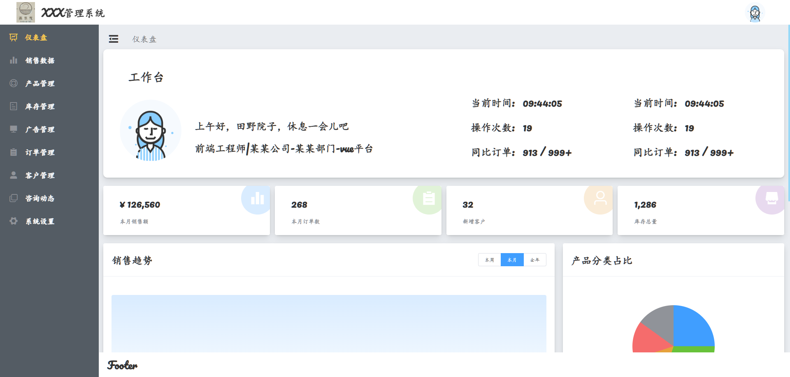

# chengyue_admin
# XXX 管理系统

## 📌 项目简介  
**XXX 管理系统** 是一个基于 `Vue2.0` 和 `Element UI` 构建的企业管理后台，提供销售数据、产品管理、库存管理、客户管理等功能，帮助企业高效管理业务流程。

## 🎯 功能概览  
- **📊 仪表盘**：展示销售数据、订单情况、库存信息等关键指标。  
- **📈 销售数据**：统计销售额、订单数量、同比分析等。  
- **📦 产品管理**：维护产品信息，包括分类、价格、库存等。  
- **🏬 库存管理**：监控库存状态，防止库存不足或过量。  
- **📢 广告管理**：管理平台广告内容及投放情况。  
- **📜 订单管理**：管理订单详情、状态跟踪及分析。  
- **👤 客户管理**：维护客户信息，记录新增客户数据。  
- **💬 咨询动态**：记录和管理客户咨询内容。  
- **⚙️ 系统设置**：包括用户权限管理、系统配置等功能。  

---

## 🚀 技术栈  
| 技术 | 说明 |
|------|------|
| **Vue.js** | 前端框架 |
| **Vue Router** | 路由管理 |
| **Vuex** | 状态管理 |
| **Element UI** | 前端 UI 组件库 |
| **Axios** | 网络请求库 |
| **ECharts** | 数据可视化 |
| **后端（可选）** | express.js / Node.js  |
| **数据库（可选）** | sql serve |

---

## 📂 目录结构  
```bash
├── src
│   ├── assets        # 静态资源（图片、图标等）
│   ├── components      # 组件（公用组件）
│   │   ├── Cyecharts.vue 
│   │   ├── Cyheader.vue
│   │   ├── Cysearch.vue
│   │   ├── Weight.vue  
│   ├── Cypage #导航栏对应页面
│   │   ├── settings
│   │   │   ├── Cysettings.vue
│   │   ├── Cyad.vue
│   │   ├── Cyassets.vue 
│   │   ├── Cyclient.vue
│   │   ├── Cyconsult.vue 
│   │   ├── Cyhome.vue
│   │   ├── Cyinventory.vue 
│   │   ├── Cymarket.vue 
│   │   ├── Cyorder.vue 
│   │   ├── Cyproduct.vue   
│   ├── router          # 路由配置
│   ├── store           # Vuex 状态管理
│   ├── views           # 业务页面组件
│   ├── utils           # 工具函数
│   ├── main.js         # 入口文件
│   ├── App.vue         # 根组件
│── public              # 公共静态文件
│── package.json        # 依赖管理
│── vue.config.js       # Vue 配置文件
└── README.md           # 项目说明文档
```




## Project setup
```
npm install
```

### Compiles and hot-reloads for development
```
npm run serve
```

### Compiles and minifies for production
```
npm run build
```

### Lints and fixes files
```
npm run lint
```

### Customize configuration
See [Configuration Reference](https://cli.vuejs.org/config/).

# 未经作者授权，不可商用，否则追究其法律责任

## 联系作者

###
```
ysygitcode@163.com  /  boomchengyue@gmail.com 
```
